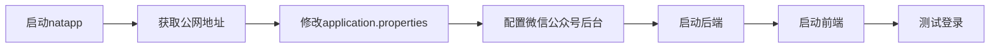

# 内网穿透配置指南 - 微信公众号登录本地开发

## 📌 为什么需要内网穿透？

微信公众号登录流程：

```
用户扫码 → 微信服务器 → 回调你的后端 /auth/wechat/callback → 处理登录
```

**问题**：微信服务器在公网，无法访问你的 `localhost:8080`

**解决**：使用内网穿透把本地后端暴露到公网

## 🚀 快速开始（natapp 推荐）

### 步骤1：下载 natapp

1. 访问：https://natapp.cn/
2. 下载 Windows 版本
3. 解压得到 `natapp.exe`

### 步骤2：注册并获取隧道

1. 在 https://natapp.cn/ 注册账号
2. 进入"我的隧道"，点击"购买隧道"
3. **选择免费隧道**（足够开发使用）
4. 配置信息：
   - 隧道协议：`http`
   - 本地端口：`8080`
   - 隧道名称：`yinianzhida`（随意）

5. 购买成功后，记下你的 **authtoken**（类似：`abc123def456`）

### 步骤3：启动内网穿透

打开命令行，进入 natapp.exe 所在目录：

```bash
# Windows
natapp.exe -authtoken=你的authtoken

# 示例
natapp.exe -authtoken=abc123def456
```

启动成功后会显示：

```
Forwarding http://ja7bf743.natappfree.cc -> 127.0.0.1:8080
```

**重要**：记下这个公网地址 `http://ja7bf743.natappfree.cc`

### 步骤4：修改配置文件

打开 `yinianzhida/src/main/resources/application.properties`

找到这一行：

```properties
wechat.callback.url=${WECHAT_CALLBACK_URL:http://your-natapp-domain.natappfree.cc/auth/wechat/callback}
```

修改为你的 natapp 地址：

```properties
wechat.callback.url=${WECHAT_CALLBACK_URL:http://ja7bf743.natappfree.cc/auth/wechat/callback}
```

**注意**：
- 保留 `/auth/wechat/callback` 路径
- 只替换域名部分

### 步骤5：配置微信公众号后台

1. 登录微信公众平台：https://mp.weixin.qq.com/
2. 进入"设置与开发" → "接口权限" → "网页授权"
3. 点击"修改"授权回调域名
4. 填写：`ja7bf743.natappfree.cc`（**不要加 http:// 和路径**）
5. 按要求下载验证文件，放到后端项目的 `static` 目录
6. 保存

### 步骤6：启动项目

**终端1 - 内网穿透**：
```bash
natapp.exe -authtoken=你的authtoken
# 保持运行
```

**终端2 - 后端**：
```bash
cd yinianzhida
./mvnw spring-boot:run
```

**终端3 - 前端**：
```bash
cd qianduanyemianzhanshi
npm run dev
```

### 步骤7：测试登录

1. 访问前端：http://localhost:3000/login
2. 页面会自动生成二维码
3. 用微信扫码
4. 授权后，微信会回调到你的 natapp 地址
5. 内网穿透转发到本地 8080 端口
6. 登录成功，跳转首页！

## 📋 完整的开发流程



## 🔧 常见问题

### Q1: natapp 地址每次重启都变怎么办？

**问题**：免费版 natapp 每次启动会分配不同的域名

**解决方案1（推荐）**：购买付费隧道（9元/月），固定域名
- 登录 natapp → 我的隧道 → 购买隧道
- 选择 VIP_1 型（固定域名）
- 配置一次后就不用再改了

**解决方案2**：使用环境变量
```bash
# Windows 设置环境变量
set WECHAT_CALLBACK_URL=http://新的natapp地址/auth/wechat/callback

# 重启后端即可，不用改代码
./mvnw spring-boot:run
```

**解决方案3**：写个脚本自动更新
```bash
# update-natapp.bat
@echo off
echo 请输入新的natapp地址（不含http://）:
set /p NATAPP_DOMAIN=
echo wechat.callback.url=http://%NATAPP_DOMAIN%/auth/wechat/callback > natapp-config.txt
echo 已更新配置，请手动复制到 application.properties
pause
```

### Q2: 配置微信公众号后台时找不到验证文件怎么办？

**问题**：微信要求放置验证文件到域名根目录

**解决方法**：
1. 下载微信给的验证文件（如 `MP_verify_xxx.txt`）
2. 放到 `yinianzhida/src/main/resources/static/` 目录
3. 重启后端
4. 访问测试：`http://你的natapp地址/MP_verify_xxx.txt`
5. 能访问到就可以在微信后台验证了

### Q3: 扫码后提示"redirect_uri参数错误"

**原因**：微信公众号后台配置的回调域名与实际不符

**检查**：
1. 微信后台配置的域名是否正确（不要带http://和路径）
2. application.properties 中的地址是否正确
3. natapp 是否正在运行
4. 重启后端让配置生效

### Q4: 前端能访问但扫码不行？

**排查步骤**：
1. 检查 natapp 是否正在运行
2. 访问 `http://你的natapp地址/test/hello` 测试连通性
3. 查看 natapp 控制台是否有请求日志
4. 查看后端控制台是否有错误

### Q5: 多人开发时如何配置？

**方法1**：每个人用自己的 natapp 隧道
```properties
# 张三的配置
wechat.callback.url=http://zhangsan.natappfree.cc/auth/wechat/callback

# 李四的配置
wechat.callback.url=http://lisi.natappfree.cc/auth/wechat/callback
```

**方法2**：团队共用一个付费固定域名
```properties
# 团队共用
wechat.callback.url=http://dev.applymind.com/auth/wechat/callback
```

**方法3**：使用 `.gitignore` 忽略本地配置
```bash
# 创建 application-local.properties（不提交到git）
wechat.callback.url=http://你的natapp地址/auth/wechat/callback

# 启动时指定
./mvnw spring-boot:run -Dspring.profiles.active=local
```

## 🎯 其他内网穿透工具

### ngrok（国际版）

```bash
# 下载：https://ngrok.com/
ngrok http 8080

# 会得到类似的地址
https://abc123.ngrok.io
```

**优点**：稳定、功能强大
**缺点**：国内访问较慢，免费版不固定域名

### 花生壳

```bash
# 下载：https://www.oray.com/
# 使用客户端配置
```

**优点**：老牌工具，稳定
**缺点**：免费版限速

### frp（自建）

需要一台有公网IP的服务器，适合团队使用

**优点**：完全自主控制
**缺点**：需要服务器，配置复杂

## 📊 不同方案对比

| 工具 | 免费版 | 付费版 | 稳定性 | 速度 | 推荐度 |
|------|--------|--------|--------|------|--------|
| natapp | ✅ 随机域名 | ✅ 固定域名 9元/月 | ⭐⭐⭐⭐⭐ | ⭐⭐⭐⭐⭐ | ⭐⭐⭐⭐⭐ |
| ngrok | ✅ 随机域名 | ✅ 固定域名 $8/月 | ⭐⭐⭐⭐ | ⭐⭐⭐ | ⭐⭐⭐⭐ |
| 花生壳 | ✅ 限速 | ✅ 不限速 | ⭐⭐⭐⭐ | ⭐⭐⭐ | ⭐⭐⭐ |
| frp | ❌ 需服务器 | ✅ 完全自主 | ⭐⭐⭐⭐⭐ | ⭐⭐⭐⭐⭐ | ⭐⭐⭐ |

**推荐**：个人开发用 natapp 免费版，团队开发买个 natapp 固定域名共用

## 💡 生产环境部署

生产环境不需要内网穿透，直接部署到服务器：

```properties
# 生产环境配置
wechat.callback.url=https://api.applymind.com/auth/wechat/callback
```

**注意**：
1. 使用 HTTPS（微信要求）
2. 配置真实域名
3. 在微信公众号后台配置生产域名

## 🔒 安全建议

1. **不要在生产环境使用内网穿透**
2. **不要泄露 authtoken**（相当于密码）
3. **开发完成后关闭 natapp**（避免暴露本地服务）
4. **定期更换 authtoken**

## 📝 快速检查清单

开发微信登录前，确保：

- [ ] natapp 已启动并获取公网地址
- [ ] application.properties 已配置正确的回调地址
- [ ] 微信公众号后台已配置回调域名
- [ ] 验证文件已放置并可访问
- [ ] 后端已启动（8080端口）
- [ ] 前端已启动（3000端口）
- [ ] 测试地址：http://你的natapp地址/test/hello 可访问

## 🎉 成功标志

当你看到：

1. natapp 显示 `Forwarding http://xxx.natappfree.cc -> 127.0.0.1:8080`
2. 后端启动成功
3. 前端能生成二维码
4. 扫码后微信能跳转
5. 登录成功跳转首页

恭喜！内网穿透配置成功！🎊

---

**一念职达（ApplyMind）** - AI赋能求职，一键直达理想Offer
