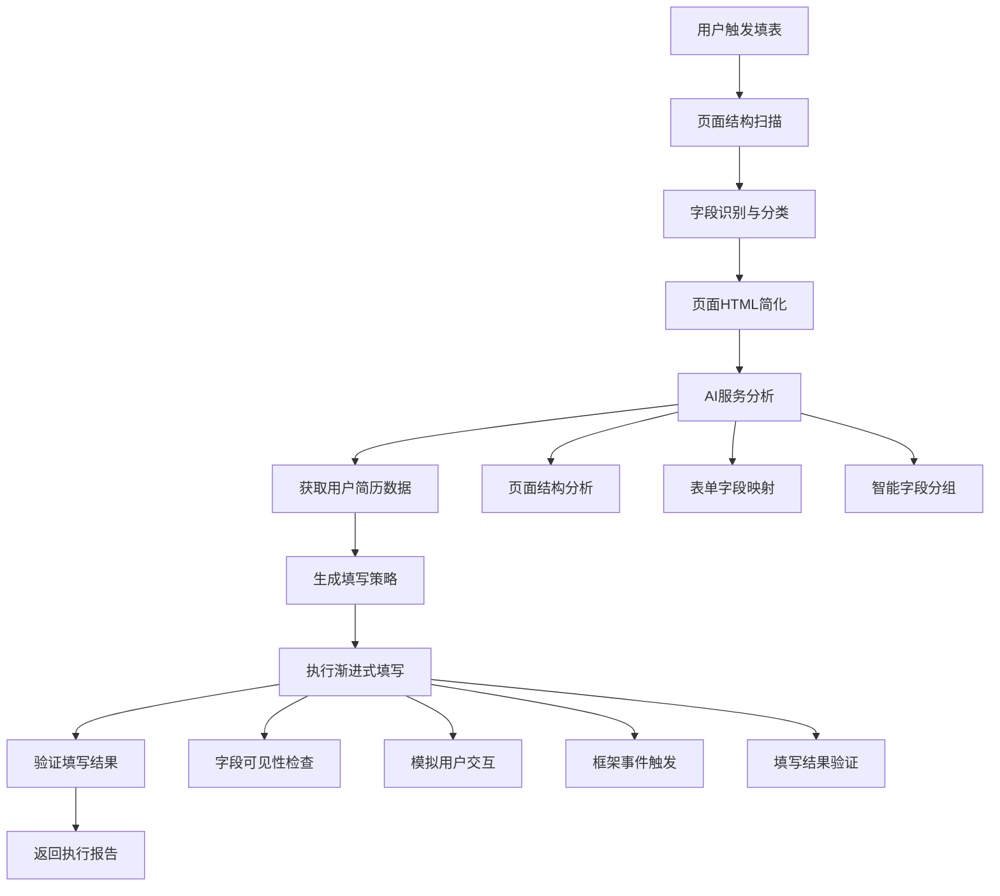
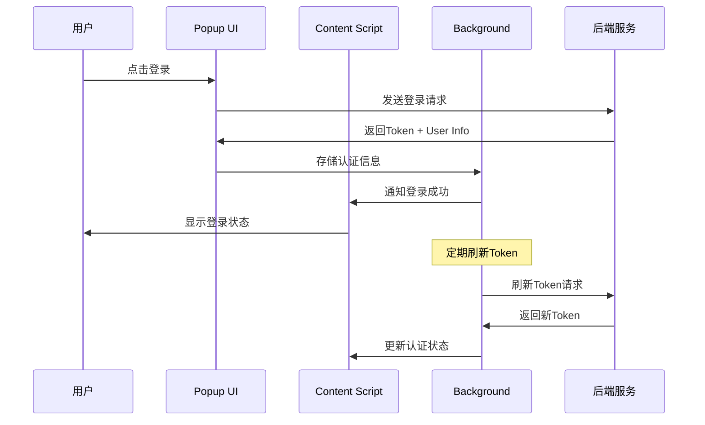

# 一念职达助手 - 具体实现逻辑文档

## 📋 目录

- [系统架构](#系统架构)
- [核心模块设计](#核心模块设计)
- [AI自动填表引擎](#ai自动填表引擎)
- [认证系统实现](#认证系统实现)
- [浏览器扩展架构](#浏览器扩展架构)
- [数据流程设计](#数据流程设计)
- [错误处理机制](#错误处理机制)
- [性能优化策略](#性能优化策略)

## 🏗️ 系统架构

### 整体架构图

```
┌─────────────────┐    ┌─────────────────┐    ┌─────────────────┐
│   Web Pages    │    │  Chrome Ext     │    │   Backend API   │
│                │    │                │    │                │
│  ┌───────────┐  │    │ ┌─────────────┐ │    │ ┌─────────────┐ │
│  │Job Forms  │◄─┼────┼►│Content Script│◄┼────┼►│Auth Service │ │
│  └───────────┘  │    │ └─────────────┘ │    │ └─────────────┘ │
│                │    │ ┌─────────────┐ │    │ ┌─────────────┐ │
│  ┌───────────┐  │    │ │   Popup     │ │    │ │AI Service   │ │
│  │Dynamic UI │◄─┼────┼►│    UI       │ │    │ │             │ │
│  └───────────┘  │    │ └─────────────┘ │    │ └─────────────┘ │
│                │    │ ┌─────────────┐ │    │ ┌─────────────┐ │
│                │    │ │Background   │ │    │ │User Service │ │
│                │    │ │Service      │ │    │ │             │ │
│                │    │ └─────────────┘ │    │ └─────────────┘ │
└─────────────────┘    └─────────────────┘    └─────────────────┘
```

### 技术栈

#### 前端扩展
- **Manifest V3** - Chrome扩展框架
- **Vanilla JavaScript** - 原生JS，无框架依赖
- **CSS3** - 样式设计
- **Chrome APIs** - 扩展功能接口

#### 后端服务
- **Node.js** - 服务器运行环境
- **Express.js** - Web框架
- **JWT** - 认证令牌
- **AI/ML Service** - 智能分析服务

#### 数据存储
- **Chrome Storage** - 本地数据缓存
- **Database** - 用户数据持久化

## 🧩 核心模块设计

### 1. 配置管理模块 (config.js)

```javascript
/**
 * 统一配置管理
 * 支持开发/生产环境切换
 */
const CONFIG = {
    ENV: 'development',

    DEVELOPMENT: {
        WEB_BASE_URL: 'http://localhost:3000',
        API_BASE_URL: 'http://localhost:8080'
    },

    PRODUCTION: {
        WEB_BASE_URL: 'https://your-production-web.com',
        API_BASE_URL: 'https://your-production-api.com'
    },

    // 动态获取当前环境配置
    getCurrentConfig() {
        return this[this.ENV.toUpperCase()];
    },

    // 获取API基础URL
    getApiBaseUrl() {
        return this.getCurrentConfig().API_BASE_URL;
    }
};
```

**设计要点**：
- 环境配置集中管理
- 运行时动态切换
- 全局可访问性
- 向后兼容性

### 2. 认证管理模块 (auth-manager.js)

```javascript
/**
 * 认证状态管理
 * 双令牌机制实现
 */
class AuthManager {
    constructor() {
        this.tokens = {
            access: null,
            refresh: null
        };
        this.refreshTimer = null;
        this.refreshPromise = null;
    }

    /**
     * 保存认证信息
     */
    async saveAuthData(authData) {
        this.tokens.access = authData.accessToken;
        this.tokens.refresh = authData.refreshToken;

        // 保存到chrome.storage
        await this.saveToStorage({
            auth_token: authData.accessToken,
            refresh_token: authData.refreshToken,
            user_info: authData.user
        });

        // 启动自动刷新机制
        this.startTokenRefresh(authData.expiresIn);
    }

    /**
     * 自动刷新令牌
     */
    startTokenRefresh(expiresIn) {
        // 在令牌到期前1分钟刷新
        const refreshTime = (expiresIn - 60) * 1000;

        this.refreshTimer = setTimeout(async () => {
            await this.refreshToken();
        }, refreshTime);
    }

    /**
     * 刷新访问令牌
     */
    async refreshToken() {
        if (this.refreshPromise) {
            return this.refreshPromise;
        }

        this.refreshPromise = this.performTokenRefresh();
        const result = await this.refreshPromise;
        this.refreshPromise = null;

        return result;
    }

    async performTokenRefresh() {
        try {
            const response = await fetch(`${CONFIG.getApiBaseUrl()}/api/auth/refresh`, {
                method: 'POST',
                headers: {
                    'Authorization': `Bearer ${this.tokens.refresh}`,
                    'Content-Type': 'application/json'
                }
            });

            if (response.ok) {
                const data = await response.json();
                this.tokens.access = data.data.accessToken;

                // 更新存储
                await this.updateStorageToken(data.data.accessToken);

                // 重新开始刷新计时
                this.startTokenRefresh(data.data.expiresIn);

                return { success: true };
            } else {
                // 刷新失败，清除认证信息
                await this.clearAuth();
                return { success: false, error: 'Token refresh failed' };
            }
        } catch (error) {
            console.error('Token refresh error:', error);
            return { success: false, error: error.message };
        }
    }
}
```

**设计要点**：
- 双令牌机制（access/refresh）
- 自动刷新机制
- 跨标签页同步
- 异常处理和重试

### 3. 表单字段扫描器 (FieldScanner.js)

```javascript
/**
 * 表单字段智能扫描
 */
class FieldScanner {
    constructor() {
        this.fieldTypes = {
            // 个人信息
            'name': ['name', 'fullname', 'realname', '姓名', '真实姓名'],
            'phone': ['phone', 'mobile', 'tel', '手机', '电话', '联系方式'],
            'email': ['email', 'mail', '邮箱', '邮件地址'],
            'gender': ['gender', 'sex', '性别'],
            'birthday': ['birthday', 'birth', 'birthdate', '生日', '出生日期'],

            // 教育信息
            'school': ['school', 'university', 'college', '学校', '院校'],
            'major': ['major', 'specialty', '专业'],
            'education': ['education', 'degree', '学历', '学位'],

            // 工作信息
            'company': ['company', 'corporation', '公司', '单位'],
            'position': ['position', 'job', 'title', '职位', '岗位'],
            'experience': ['experience', 'workexp', '工作经历', '工作经验']
        };

        this.selectors = [
            'input[type="text"]',
            'input[type="email"]',
            'input[type="tel"]',
            'input[type="number"]',
            'input[type="date"]',
            'select',
            'textarea'
        ];
    }

    /**
     * 扫描页面表单字段
     */
    async scan() {
        const fields = [];
        const elements = document.querySelectorAll(this.selectors.join(','));

        for (const element of elements) {
            const field = this.analyzeField(element);
            if (field) {
                fields.push(field);
            }
        }

        // 按重要性和位置排序
        return this.sortFields(fields);
    }

    /**
     * 分析单个字段
     */
    analyzeField(element) {
        if (!this.isVisibleField(element)) {
            return null;
        }

        const fieldInfo = {
            element: element,
            tagName: element.tagName.toLowerCase(),
            type: element.type || 'text',
            name: element.name || '',
            id: element.id || '',
            className: element.className || '',
            placeholder: element.placeholder || '',
            required: element.required || false
        };

        // 获取关联的label
        fieldInfo.label = this.findLabel(element);

        // 识别字段类型
        fieldInfo.fieldType = this.identifyFieldType(fieldInfo);

        // 生成唯一选择器
        fieldInfo.selector = this.generateSelector(element);

        // 获取字段上下文
        fieldInfo.context = this.getFieldContext(element);

        return fieldInfo;
    }

    /**
     * 识别字段类型
     */
    identifyFieldType(fieldInfo) {
        const text = [
            fieldInfo.name,
            fieldInfo.id,
            fieldInfo.className,
            fieldInfo.placeholder,
            fieldInfo.label
        ].join(' ').toLowerCase();

        // 遍历字段类型关键词
        for (const [type, keywords] of Object.entries(this.fieldTypes)) {
            for (const keyword of keywords) {
                if (text.includes(keyword.toLowerCase())) {
                    return type;
                }
            }
        }

        // 基于输入类型推断
        switch (fieldInfo.type) {
            case 'email':
                return 'email';
            case 'tel':
                return 'phone';
            case 'date':
                return 'date';
            default:
                return 'unknown';
        }
    }

    /**
     * 查找字段标签
     */
    findLabel(element) {
        // 方法1: 通过for属性关联
        if (element.id) {
            const label = document.querySelector(`label[for="${element.id}"]`);
            if (label) return label.textContent.trim();
        }

        // 方法2: 父元素中的label
        let parent = element.parentElement;
        while (parent && parent.tagName !== 'FORM') {
            const label = parent.querySelector('label');
            if (label && parent.contains(element)) {
                return label.textContent.trim();
            }
            parent = parent.parentElement;
        }

        // 方法3: 前置兄弟元素
        let sibling = element.previousElementSibling;
        while (sibling) {
            if (sibling.tagName === 'LABEL' ||
                sibling.textContent.trim().length > 0) {
                return sibling.textContent.trim();
            }
            sibling = sibling.previousElementSibling;
        }

        return '';
    }

    /**
     * 生成CSS选择器
     */
    generateSelector(element) {
        // 优先使用ID
        if (element.id) {
            return `#${element.id}`;
        }

        // 使用name属性
        if (element.name) {
            return `${element.tagName.toLowerCase()}[name="${element.name}"]`;
        }

        // 使用唯一类名
        if (element.className) {
            const classes = element.className.split(' ').filter(cls => cls.trim());
            if (classes.length > 0) {
                const selector = `.${classes.join('.')}`;
                if (document.querySelectorAll(selector).length === 1) {
                    return selector;
                }
            }
        }

        // 生成路径选择器
        return this.generatePathSelector(element);
    }

    /**
     * 生成元素路径选择器
     */
    generatePathSelector(element) {
        const path = [];
        let current = element;

        while (current && current.tagName !== 'HTML') {
            let selector = current.tagName.toLowerCase();

            if (current.id) {
                selector += `#${current.id}`;
                path.unshift(selector);
                break;
            }

            if (current.className) {
                const classes = current.className.split(' ').filter(cls => cls.trim());
                if (classes.length > 0) {
                    selector += `.${classes[0]}`;
                }
            }

            // 添加nth-child避免歧义
            const siblings = Array.from(current.parentNode?.children || [])
                .filter(child => child.tagName === current.tagName);
            if (siblings.length > 1) {
                const index = siblings.indexOf(current) + 1;
                selector += `:nth-child(${index})`;
            }

            path.unshift(selector);
            current = current.parentElement;
        }

        return path.join(' > ');
    }
}
```

### 4. 智能填写器 (ProgressiveFiller.js)

```javascript
/**
 * 渐进式表单填写器
 */
class ProgressiveFiller {
    constructor() {
        this.fillStrategies = new Map();
        this.eventSimulator = new EventSimulator();
        this.frameworkAdapter = new FrameworkAdapter();
        this.fillHistory = [];
        this.retryCount = 3;
    }

    /**
     * 执行批量填写
     */
    async fillForm(fields, data, options = {}) {
        const results = {
            total: fields.length,
            success: 0,
            failed: 0,
            details: []
        };

        // 按优先级排序字段
        const sortedFields = this.prioritizeFields(fields);

        for (const field of sortedFields) {
            const fillResult = await this.fillSingleField(field, data, options);

            results.details.push(fillResult);
            if (fillResult.success) {
                results.success++;
            } else {
                results.failed++;
            }

            // 添加延迟避免过快操作
            if (options.delay) {
                await this.sleep(options.delay);
            }
        }

        return results;
    }

    /**
     * 填写单个字段
     */
    async fillSingleField(field, data, options = {}) {
        const startTime = Date.now();
        let lastError = null;

        // 获取填写值
        const value = this.getFieldValue(field, data);
        if (value === null || value === undefined) {
            return {
                field: field.fieldType,
                success: false,
                error: 'No matching data found',
                duration: Date.now() - startTime
            };
        }

        // 重试机制
        for (let attempt = 1; attempt <= this.retryCount; attempt++) {
            try {
                const element = this.findElement(field);
                if (!element) {
                    throw new Error('Element not found');
                }

                // 检查元素是否可交互
                if (!this.isInteractable(element)) {
                    await this.makeElementInteractable(element);
                }

                // 执行填写
                await this.performFill(element, value, field);

                // 验证填写结果
                if (await this.validateFill(element, value)) {
                    return {
                        field: field.fieldType,
                        success: true,
                        value: value,
                        duration: Date.now() - startTime,
                        attempts: attempt
                    };
                }

            } catch (error) {
                lastError = error;
                console.warn(`Fill attempt ${attempt} failed for ${field.fieldType}:`, error);

                if (attempt < this.retryCount) {
                    await this.sleep(500 * attempt); // 递增延迟
                }
            }
        }

        return {
            field: field.fieldType,
            success: false,
            error: lastError?.message || 'Fill failed after retries',
            duration: Date.now() - startTime,
            attempts: this.retryCount
        };
    }

    /**
     * 执行具体填写操作
     */
    async performFill(element, value, field) {
        const tagName = element.tagName.toLowerCase();

        switch (tagName) {
            case 'input':
                await this.fillInput(element, value, field);
                break;
            case 'select':
                await this.fillSelect(element, value, field);
                break;
            case 'textarea':
                await this.fillTextarea(element, value, field);
                break;
            default:
                throw new Error(`Unsupported element type: ${tagName}`);
        }

        // 触发框架特定事件
        await this.frameworkAdapter.triggerEvents(element, value);
    }

    /**
     * 填写输入框
     */
    async fillInput(element, value, field) {
        const inputType = element.type?.toLowerCase() || 'text';

        switch (inputType) {
            case 'text':
            case 'email':
            case 'tel':
            case 'number':
                await this.fillTextInput(element, value);
                break;
            case 'date':
                await this.fillDateInput(element, value);
                break;
            case 'radio':
                await this.selectRadio(element, value);
                break;
            case 'checkbox':
                await this.toggleCheckbox(element, value);
                break;
            default:
                await this.fillTextInput(element, value);
        }
    }

    /**
     * 填写文本输入框
     */
    async fillTextInput(element, value) {
        // 聚焦元素
        element.focus();
        await this.sleep(100);

        // 清空现有内容
        element.value = '';

        // 触发清空事件
        this.eventSimulator.triggerEvent(element, 'input');
        await this.sleep(50);

        // 模拟键盘输入
        if (this.shouldSimulateTyping(element)) {
            await this.simulateTyping(element, value);
        } else {
            // 直接设置值
            element.value = value;
            this.eventSimulator.triggerEvent(element, 'input');
            this.eventSimulator.triggerEvent(element, 'change');
        }

        // 失焦
        element.blur();
        await this.sleep(100);
    }

    /**
     * 模拟打字输入
     */
    async simulateTyping(element, text) {
        for (let i = 0; i < text.length; i++) {
            const char = text[i];

            // 模拟按键事件
            this.eventSimulator.triggerKeyEvent(element, 'keydown', char);

            // 更新值
            element.value += char;

            // 触发输入事件
            this.eventSimulator.triggerEvent(element, 'input');

            // 模拟按键抬起
            this.eventSimulator.triggerKeyEvent(element, 'keyup', char);

            // 添加随机延迟模拟人工输入
            await this.sleep(50 + Math.random() * 100);
        }
    }

    /**
     * 填写下拉选择框
     */
    async fillSelect(element, value, field) {
        const options = Array.from(element.options);
        let selectedOption = null;

        // 精确匹配
        selectedOption = options.find(opt =>
            opt.value === value || opt.textContent.trim() === value
        );

        if (!selectedOption) {
            // 模糊匹配
            selectedOption = options.find(opt =>
                opt.textContent.trim().includes(value) ||
                value.includes(opt.textContent.trim())
            );
        }

        if (!selectedOption) {
            // 智能匹配（如学历等）
            selectedOption = this.smartMatch(options, value, field.fieldType);
        }

        if (selectedOption) {
            element.value = selectedOption.value;
            element.selectedIndex = Array.from(options).indexOf(selectedOption);

            this.eventSimulator.triggerEvent(element, 'change');
            return true;
        }

        throw new Error(`No matching option found for value: ${value}`);
    }

    /**
     * 智能选项匹配
     */
    smartMatch(options, value, fieldType) {
        const matchRules = {
            'education': {
                '本科': ['本科', '学士', 'bachelor', '大学'],
                '硕士': ['硕士', '研究生', 'master'],
                '博士': ['博士', 'doctor', 'phd']
            },
            'gender': {
                '男': ['男', 'male', 'm', '先生'],
                '女': ['女', 'female', 'f', '女士']
            }
        };

        const rules = matchRules[fieldType];
        if (!rules) return null;

        const normalizedValue = value.toLowerCase();

        for (const [key, synonyms] of Object.entries(rules)) {
            if (synonyms.some(syn => normalizedValue.includes(syn.toLowerCase()))) {
                return options.find(opt =>
                    synonyms.some(syn =>
                        opt.textContent.toLowerCase().includes(syn.toLowerCase())
                    )
                );
            }
        }

        return null;
    }

    /**
     * 获取字段填写值
     */
    getFieldValue(field, data) {
        // 直接字段匹配
        if (data[field.fieldType]) {
            return data[field.fieldType];
        }

        // 基于标签的智能匹配
        const label = field.label?.toLowerCase() || '';
        const mapping = {
            '真实姓名': 'name',
            '联系电话': 'phone',
            '电子邮箱': 'email',
            '毕业院校': 'school',
            '所学专业': 'major',
            '工作单位': 'company',
            '职位名称': 'position'
        };

        for (const [key, fieldType] of Object.entries(mapping)) {
            if (label.includes(key) && data[fieldType]) {
                return data[fieldType];
            }
        }

        return null;
    }

    /**
     * 验证填写结果
     */
    async validateFill(element, expectedValue) {
        await this.sleep(100); // 等待DOM更新

        const actualValue = element.value || element.textContent;

        // 完全匹配
        if (actualValue === expectedValue) {
            return true;
        }

        // 包含匹配（用于下拉框等）
        if (actualValue.includes(expectedValue) ||
            expectedValue.includes(actualValue)) {
            return true;
        }

        // 数字值比较
        if (!isNaN(actualValue) && !isNaN(expectedValue)) {
            return parseFloat(actualValue) === parseFloat(expectedValue);
        }

        return false;
    }

    /**
     * 工具方法
     */
    sleep(ms) {
        return new Promise(resolve => setTimeout(resolve, ms));
    }

    isInteractable(element) {
        return element.offsetParent !== null &&
               !element.disabled &&
               !element.readOnly &&
               getComputedStyle(element).visibility !== 'hidden';
    }

    async makeElementInteractable(element) {
        // 滚动到元素位置
        element.scrollIntoView({ behavior: 'smooth', block: 'center' });
        await this.sleep(300);

        // 展开可能的父级容器
        const expandableParent = element.closest('[data-expandable], .expandable');
        if (expandableParent) {
            const expandButton = expandableParent.querySelector('[data-expand], .expand-btn');
            if (expandButton) {
                expandButton.click();
                await this.sleep(500);
            }
        }

        // 移除可能的遮挡元素
        const overlay = document.querySelector('.modal, .overlay, .popup');
        if (overlay && overlay.contains(element)) {
            const closeBtn = overlay.querySelector('[data-close], .close, .modal-close');
            if (closeBtn) {
                closeBtn.click();
                await this.sleep(300);
            }
        }
    }
}
```

## 🤖 AI自动填表引擎

### AutoFillMain 主控制器

```javascript
/**
 * AI自动填表主引擎
 */
class AutoFillMain {
    constructor(options = {}) {
        this.config = {
            aiServiceURL: options.aiServiceURL || 'http://localhost:8080',
            retryAttempts: options.retryAttempts || 3,
            fillDelay: options.fillDelay || 200,
            debug: options.debug || false
        };

        this.state = {
            status: 'idle', // idle, scanning, analyzing, filling, completed, error
            sessionId: null,
            scannedFields: [],
            fillData: null,
            progress: 0
        };

        this.modules = {
            scanner: new FieldScanner(),
            filler: new ProgressiveFiller(),
            expander: new FormExpander(),
            aiService: new AIService(this.config.aiServiceURL)
        };

        this.callbacks = {
            onProgress: null,
            onComplete: null,
            onError: null
        };
    }

    /**
     * 启动自动填表流程
     */
    async start(options = {}) {
        try {
            this.updateState('scanning', { progress: 0 });

            // 第1步：展开动态表单
            await this.expandDynamicForms();
            this.updateProgress(20);

            // 第2步：扫描表单字段
            const fields = await this.scanFormFields();
            this.updateProgress(40);

            // 第3步：AI分析页面结构
            const analysisResult = await this.analyzePageStructure(fields, options);
            this.updateProgress(60);

            // 第4步：生成填写方案
            const fillPlan = await this.generateFillPlan(analysisResult, options);
            this.updateProgress(80);

            // 第5步：执行填写
            const fillResult = await this.executeFillPlan(fillPlan);
            this.updateProgress(100);

            this.updateState('completed', {
                result: fillResult,
                progress: 100
            });

            return {
                success: true,
                filled: fillResult.success,
                total: fillResult.total,
                details: fillResult.details
            };

        } catch (error) {
            console.error('[AutoFill] Error:', error);
            this.updateState('error', { error: error.message });

            if (this.callbacks.onError) {
                this.callbacks.onError(error);
            }

            return {
                success: false,
                error: error.message
            };
        }
    }

    /**
     * 展开动态表单
     */
    async expandDynamicForms() {
        this.updateState('expanding');

        // 查找并点击可能的展开按钮
        const expandButtons = [
            '[data-expand]',
            '.expand-btn',
            '.show-more',
            '.collapse-trigger',
            '[aria-expanded="false"]'
        ];

        for (const selector of expandButtons) {
            const buttons = document.querySelectorAll(selector);
            for (const btn of buttons) {
                if (btn.offsetParent !== null) {
                    btn.click();
                    await this.sleep(300);
                }
            }
        }

        // 触发懒加载内容
        await this.triggerLazyLoad();
    }

    /**
     * 扫描表单字段
     */
    async scanFormFields() {
        this.updateState('scanning');

        const fields = await this.modules.scanner.scan();
        this.state.scannedFields = fields;

        if (this.config.debug) {
            console.group('[AutoFill] Scanned Fields');
            console.table(fields.map(f => ({
                type: f.fieldType,
                label: f.label,
                selector: f.selector,
                required: f.required
            })));
            console.groupEnd();
        }

        return fields;
    }

    /**
     * AI页面结构分析
     */
    async analyzePageStructure(fields, options) {
        this.updateState('analyzing');

        const pageHtml = this.getSimplifiedHTML();
        const analysisRequest = {
            html: pageHtml,
            url: window.location.href,
            companyName: options.companyName || '',
            positionName: options.positionName || ''
        };

        const result = await this.modules.aiService.analyzePage(analysisRequest);
        this.state.sessionId = result.sessionId;

        return result;
    }

    /**
     * 生成填写方案
     */
    async generateFillPlan(analysisResult, options) {
        const fillRequest = {
            sessionId: this.state.sessionId,
            resumeId: options.resumeId,
            companyName: options.companyName || '',
            positionName: options.positionName || '',
            customData: options.customData || {}
        };

        const fillPlan = await this.modules.aiService.fillValues(fillRequest);
        this.state.fillData = fillPlan.fillData;

        return fillPlan;
    }

    /**
     * 执行填写方案
     */
    async executeFillPlan(fillPlan) {
        this.updateState('filling');

        const fillOptions = {
            delay: this.config.fillDelay,
            highlight: true,
            simulate: true
        };

        return await this.modules.filler.fillForm(
            this.state.scannedFields,
            fillPlan.fillData,
            fillOptions
        );
    }

    /**
     * 获取简化的HTML结构
     */
    getSimplifiedHTML() {
        const clone = document.cloneNode(true);

        // 移除不必要的元素
        const removeSelectors = [
            'script', 'style', 'noscript',
            '.advertisement', '.ad-banner',
            '[style*="display: none"]',
            '[hidden]'
        ];

        removeSelectors.forEach(selector => {
            const elements = clone.querySelectorAll(selector);
            elements.forEach(el => el.remove());
        });

        // 简化属性
        const allElements = clone.querySelectorAll('*');
        allElements.forEach(el => {
            // 保留关键属性
            const keepAttrs = ['id', 'name', 'class', 'type', 'placeholder', 'required'];
            const attrs = Array.from(el.attributes);

            attrs.forEach(attr => {
                if (!keepAttrs.includes(attr.name)) {
                    el.removeAttribute(attr.name);
                }
            });
        });

        return clone.documentElement.outerHTML;
    }

    /**
     * 状态管理
     */
    updateState(status, data = {}) {
        this.state.status = status;
        Object.assign(this.state, data);

        if (this.config.debug) {
            console.log(`[AutoFill] State: ${status}`, data);
        }
    }

    updateProgress(progress) {
        this.state.progress = progress;

        if (this.callbacks.onProgress) {
            this.callbacks.onProgress(progress);
        }
    }

    /**
     * 公共接口
     */
    getState() {
        return { ...this.state };
    }

    pause() {
        if (this.state.status === 'filling') {
            this.modules.filler.pause();
        }
    }

    resume() {
        if (this.state.status === 'filling') {
            this.modules.filler.resume();
        }
    }

    stop() {
        this.updateState('idle', { progress: 0 });
        this.modules.filler.stop();
    }

    // 事件回调设置
    onProgress(callback) { this.callbacks.onProgress = callback; }
    onComplete(callback) { this.callbacks.onComplete = callback; }
    onError(callback) { this.callbacks.onError = callback; }
}
```

## 🔐 认证系统实现

### 双令牌机制设计

```javascript
/**
 * JWT双令牌认证机制
 */
class TokenManager {
    constructor() {
        this.ACCESS_TOKEN_KEY = 'auth_token';
        this.REFRESH_TOKEN_KEY = 'refresh_token';
        this.USER_INFO_KEY = 'user_info';

        // 令牌配置
        this.ACCESS_TOKEN_EXPIRY = 15 * 60 * 1000;  // 15分钟
        this.REFRESH_TOKEN_EXPIRY = 14 * 24 * 60 * 60 * 1000; // 14天
        this.REFRESH_THRESHOLD = 1 * 60 * 1000;     // 提前1分钟刷新

        this.refreshTimer = null;
        this.refreshPromise = null;
    }

    /**
     * 保存认证令牌
     */
    async saveTokens(authResponse) {
        const { accessToken, refreshToken, user, expiresIn } = authResponse;

        const tokenData = {
            accessToken,
            refreshToken,
            expiresAt: Date.now() + (expiresIn * 1000),
            user
        };

        // 保存到Chrome Storage
        await this.setStorageData({
            [this.ACCESS_TOKEN_KEY]: accessToken,
            [this.REFRESH_TOKEN_KEY]: refreshToken,
            [this.USER_INFO_KEY]: user,
            token_expires_at: tokenData.expiresAt
        });

        // 启动自动刷新
        this.scheduleTokenRefresh(expiresIn * 1000);

        return tokenData;
    }

    /**
     * 获取有效的访问令牌
     */
    async getValidAccessToken() {
        const tokenData = await this.getStorageData([
            this.ACCESS_TOKEN_KEY,
            'token_expires_at'
        ]);

        const { auth_token: accessToken, token_expires_at: expiresAt } = tokenData;

        if (!accessToken) {
            throw new Error('No access token found');
        }

        // 检查是否需要刷新
        const timeUntilExpiry = expiresAt - Date.now();
        if (timeUntilExpiry <= this.REFRESH_THRESHOLD) {
            return await this.refreshAccessToken();
        }

        return accessToken;
    }

    /**
     * 刷新访问令牌
     */
    async refreshAccessToken() {
        // 防止并发刷新
        if (this.refreshPromise) {
            return await this.refreshPromise;
        }

        this.refreshPromise = this.performTokenRefresh();

        try {
            const result = await this.refreshPromise;
            return result;
        } finally {
            this.refreshPromise = null;
        }
    }

    async performTokenRefresh() {
        const tokenData = await this.getStorageData([this.REFRESH_TOKEN_KEY]);
        const refreshToken = tokenData.refresh_token;

        if (!refreshToken) {
            throw new Error('No refresh token found');
        }

        try {
            const response = await fetch(`${CONFIG.getApiBaseUrl()}/api/auth/refresh`, {
                method: 'POST',
                headers: {
                    'Authorization': `Bearer ${refreshToken}`,
                    'Content-Type': 'application/json'
                }
            });

            if (!response.ok) {
                throw new Error('Token refresh failed');
            }

            const result = await response.json();
            const newAccessToken = result.data.accessToken;
            const expiresIn = result.data.expiresIn;

            // 更新存储的令牌
            await this.setStorageData({
                [this.ACCESS_TOKEN_KEY]: newAccessToken,
                token_expires_at: Date.now() + (expiresIn * 1000)
            });

            // 重新安排下次刷新
            this.scheduleTokenRefresh(expiresIn * 1000);

            return newAccessToken;

        } catch (error) {
            // 刷新失败，清除所有认证信息
            await this.clearAuthData();
            throw new Error('Authentication expired, please login again');
        }
    }

    /**
     * 安排令牌自动刷新
     */
    scheduleTokenRefresh(expiresInMs) {
        if (this.refreshTimer) {
            clearTimeout(this.refreshTimer);
        }

        // 在到期前刷新
        const refreshTime = expiresInMs - this.REFRESH_THRESHOLD;

        if (refreshTime > 0) {
            this.refreshTimer = setTimeout(() => {
                this.refreshAccessToken().catch(error => {
                    console.error('Auto token refresh failed:', error);
                });
            }, refreshTime);
        }
    }

    /**
     * 清除认证数据
     */
    async clearAuthData() {
        if (this.refreshTimer) {
            clearTimeout(this.refreshTimer);
            this.refreshTimer = null;
        }

        await this.removeStorageData([
            this.ACCESS_TOKEN_KEY,
            this.REFRESH_TOKEN_KEY,
            this.USER_INFO_KEY,
            'token_expires_at'
        ]);
    }

    /**
     * Chrome Storage 操作的安全封装
     */
    async setStorageData(data) {
        return new Promise((resolve, reject) => {
            chrome.storage.local.set(data, () => {
                if (chrome.runtime.lastError) {
                    reject(new Error(chrome.runtime.lastError.message));
                } else {
                    resolve();
                }
            });
        });
    }

    async getStorageData(keys) {
        return new Promise((resolve, reject) => {
            chrome.storage.local.get(keys, (result) => {
                if (chrome.runtime.lastError) {
                    reject(new Error(chrome.runtime.lastError.message));
                } else {
                    resolve(result);
                }
            });
        });
    }

    async removeStorageData(keys) {
        return new Promise((resolve, reject) => {
            chrome.storage.local.remove(keys, () => {
                if (chrome.runtime.lastError) {
                    reject(new Error(chrome.runtime.lastError.message));
                } else {
                    resolve();
                }
            });
        });
    }
}
```

## 🌐 浏览器扩展架构

### Content Script 通信机制

```javascript
/**
 * Content Script - 页面注入脚本
 * 负责页面DOM操作和消息中转
 */
class ContentScriptManager {
    constructor() {
        this.messageHandlers = new Map();
        this.floatingWidget = null;
        this.autoFillEngine = null;

        this.initializeModules();
        this.setupMessageListening();
        this.createFloatingWidget();
    }

    /**
     * 初始化核心模块
     */
    initializeModules() {
        // 检查必要模块是否加载
        if (typeof AutoFillEngine !== 'undefined') {
            this.autoFillEngine = new AutoFillEngine({
                apiBaseUrl: CONFIG?.getApiBaseUrl() || 'http://localhost:8080'
            });
            console.log('[ContentScript] AutoFill引擎初始化成功');
        } else {
            console.error('[ContentScript] AutoFill引擎未加载');
        }

        // 初始化弹窗检测
        if (typeof initDynamicPopupDetection === 'function') {
            initDynamicPopupDetection();
        }
    }

    /**
     * 设置消息监听
     */
    setupMessageListening() {
        // 监听来自Popup的消息
        chrome.runtime.onMessage.addListener((message, sender, sendResponse) => {
            this.handleChromeMessage(message, sender, sendResponse);
            return true; // 异步响应
        });

        // 监听页面内消息
        window.addEventListener('message', (event) => {
            if (event.source === window) {
                this.handlePageMessage(event.data);
            }
        });
    }

    /**
     * 处理Chrome扩展消息
     */
    async handleChromeMessage(message, sender, sendResponse) {
        try {
            switch (message.type) {
                case 'TOGGLE_FLOATING_BUTTON':
                    this.toggleFloatingButton(message.enabled);
                    sendResponse({ success: true });
                    break;

                case 'START_AUTOFILL':
                    const result = await this.startAutoFill(message.options);
                    sendResponse(result);
                    break;

                case 'GET_PAGE_INFO':
                    const pageInfo = this.getPageInfo();
                    sendResponse({ success: true, data: pageInfo });
                    break;

                case 'CHECK_STATUS':
                    const status = this.getEngineStatus();
                    sendResponse({ success: true, status: status });
                    break;

                default:
                    sendResponse({ success: false, error: 'Unknown message type' });
            }
        } catch (error) {
            console.error('[ContentScript] Message handling error:', error);
            sendResponse({ success: false, error: error.message });
        }
    }

    /**
     * 处理页面内消息（如OAuth回调）
     */
    handlePageMessage(data) {
        if (data.type === 'PAGE_TO_CONTENT_AUTH' && data.source === 'plugin-callback-page') {
            this.forwardAuthToBackground(data.token, data.userInfo);
        }
    }

    /**
     * 转发认证信息到Background
     */
    forwardAuthToBackground(token, userInfo) {
        const message = {
            type: 'AUTH_SUCCESS',
            token: token,
            userInfo: userInfo
        };

        chrome.runtime.sendMessage(message, (response) => {
            if (response?.success) {
                this.notifyAuthSuccess();
            } else {
                this.notifyAuthError(response?.message || '认证失败');
            }
        });
    }

    /**
     * 创建悬浮组件
     */
    createFloatingWidget() {
        // 避免重复创建
        if (document.querySelector('.yinianzhida-floating-container')) {
            return;
        }

        const container = document.createElement('div');
        container.className = 'yinianzhida-floating-container';
        container.innerHTML = this.getFloatingWidgetHTML();

        document.body.appendChild(container);

        // 绑定事件
        this.bindFloatingEvents();

        // 恢复状态
        this.restoreFloatingState();
    }

    /**
     * 获取悬浮组件HTML
     */
    getFloatingWidgetHTML() {
        return `
            <!-- 悬浮按钮 -->
            <div class="yinianzhida-floating-button" id="yinianzhida-float-btn">
                <div class="yinianzhida-floating-button-icon">🎯</div>
            </div>

            <!-- 对话窗口 -->
            <div class="yinianzhida-chat-window" id="yinianzhida-chat-window">
                <div class="yinianzhida-chat-header">
                    <div class="yinianzhida-chat-title">
                        <div class="yinianzhida-chat-logo">🎯</div>
                        <div class="yinianzhida-chat-title-text">
                            <h3>一念直达</h3>
                            <p>使用次数：<span id="yinianzhida-usage-count">0</span>次</p>
                        </div>
                    </div>
                    <div class="yinianzhida-chat-actions">
                        <button class="yinianzhida-action-btn" id="yinianzhida-close-chat">❌</button>
                    </div>
                </div>

                <div class="yinianzhida-chat-messages" id="yinianzhida-messages">
                    <div class="yinianzhida-message system">
                        👋 您好！我是一念职达AI助手，可以帮您智能填写网申表单
                    </div>
                </div>

                <div class="yinianzhida-chat-input-area">
                    <div class="yinianzhida-chat-input-container">
                        <textarea
                            class="yinianzhida-chat-input"
                            id="yinianzhida-input"
                            placeholder="输入'开始填写'启动智能填表..."
                            rows="1"
                        ></textarea>
                        <button class="yinianzhida-send-btn" id="yinianzhida-send-btn">➤</button>
                    </div>
                </div>
            </div>
        `;
    }

    /**
     * 启动自动填表
     */
    async startAutoFill(options = {}) {
        if (!this.autoFillEngine) {
            throw new Error('AutoFill引擎未初始化');
        }

        // 检查认证状态
        const authData = await this.getAuthData();
        if (!authData?.token) {
            throw new Error('请先登录账号');
        }

        // 获取简历数据
        const resumeId = await this.getResumeId();
        if (!resumeId) {
            throw new Error('请先上传简历');
        }

        // 设置进度回调
        this.autoFillEngine.onProgress((progress) => {
            this.updateChatProgress(progress);
        });

        // 启动填表
        const result = await this.autoFillEngine.start({
            resumeId: resumeId,
            companyName: options.companyName || '',
            positionName: options.positionName || ''
        });

        // 更新使用统计
        if (result.success) {
            this.updateUsageCount();
        }

        return result;
    }

    /**
     * 获取页面信息
     */
    getPageInfo() {
        return {
            url: window.location.href,
            title: document.title,
            domain: window.location.hostname,
            hasForm: document.querySelectorAll('form, input, select, textarea').length > 0
        };
    }

    /**
     * 获取引擎状态
     */
    getEngineStatus() {
        if (!this.autoFillEngine) {
            return { status: 'uninitialized' };
        }

        return this.autoFillEngine.getState();
    }
}

// 全局错误处理
window.addEventListener('error', (event) => {
    if (event.message.includes('Extension context invalidated')) {
        console.warn('⚠️ 扩展上下文失效，建议刷新页面');

        // 显示用户友好的提示
        if (!window.__yinianzhida_context_notified) {
            window.__yinianzhida_context_notified = true;
            showContextInvalidatedNotification();
        }

        event.preventDefault();
        return true;
    }
});

function showContextInvalidatedNotification() {
    const notification = document.createElement('div');
    notification.style.cssText = `
        position: fixed; top: 0; left: 0; right: 0; z-index: 10000000;
        background: #ff9800; color: white; padding: 12px 20px;
        text-align: center; font-family: Arial, sans-serif; font-size: 14px;
        box-shadow: 0 2px 8px rgba(0,0,0,0.15);
    `;
    notification.innerHTML = `
        <span>⚠️ 一念职达插件已更新，请刷新页面以使用最新功能</span>
        <button onclick="location.reload()" style="
            background: white; color: #ff9800; border: none; padding: 6px 16px;
            margin-left: 16px; border-radius: 4px; cursor: pointer; font-weight: 600;
        ">立即刷新</button>
        <button onclick="this.parentElement.remove()" style="
            background: transparent; color: white; border: 1px solid white;
            padding: 6px 16px; margin-left: 8px; border-radius: 4px; cursor: pointer;
        ">关闭</button>
    `;

    document.body.insertBefore(notification, document.body.firstChild);
}

// 初始化Content Script管理器
const contentScriptManager = new ContentScriptManager();

console.log('✅ 一念职达插件 Content Script 已完全初始化');
```

## 📊 数据流程设计

### 自动填表数据流



### 认证数据流



## 🛡️ 错误处理机制

### 分层错误处理

```javascript
/**
 * 统一错误处理器
 */
class ErrorHandler {
    constructor() {
        this.errorTypes = {
            NETWORK_ERROR: 'network_error',
            AUTH_ERROR: 'auth_error',
            VALIDATION_ERROR: 'validation_error',
            FILL_ERROR: 'fill_error',
            SYSTEM_ERROR: 'system_error'
        };

        this.retryConfig = {
            maxRetries: 3,
            backoffFactor: 1.5,
            baseDelay: 1000
        };
    }

    /**
     * 处理API错误
     */
    handleApiError(error, context) {
        const errorInfo = {
            type: this.determineErrorType(error),
            message: error.message,
            context: context,
            timestamp: Date.now(),
            recoverable: this.isRecoverable(error)
        };

        // 记录错误
        this.logError(errorInfo);

        // 尝试恢复
        if (errorInfo.recoverable) {
            return this.attemptRecovery(errorInfo);
        }

        throw new Error(this.getUserFriendlyMessage(errorInfo));
    }

    /**
     * 确定错误类型
     */
    determineErrorType(error) {
        if (error.name === 'NetworkError' || error.message.includes('fetch')) {
            return this.errorTypes.NETWORK_ERROR;
        }

        if (error.status === 401 || error.message.includes('Unauthorized')) {
            return this.errorTypes.AUTH_ERROR;
        }

        if (error.status === 400 || error.message.includes('validation')) {
            return this.errorTypes.VALIDATION_ERROR;
        }

        if (error.message.includes('fill') || error.message.includes('element')) {
            return this.errorTypes.FILL_ERROR;
        }

        return this.errorTypes.SYSTEM_ERROR;
    }

    /**
     * 错误恢复策略
     */
    async attemptRecovery(errorInfo) {
        switch (errorInfo.type) {
            case this.errorTypes.NETWORK_ERROR:
                return await this.retryWithBackoff(() =>
                    this.retryLastOperation(errorInfo.context)
                );

            case this.errorTypes.AUTH_ERROR:
                return await this.refreshAuthAndRetry(errorInfo.context);

            case this.errorTypes.FILL_ERROR:
                return await this.retryFillOperation(errorInfo.context);

            default:
                throw new Error(this.getUserFriendlyMessage(errorInfo));
        }
    }

    /**
     * 指数退避重试
     */
    async retryWithBackoff(operation) {
        let lastError = null;

        for (let attempt = 1; attempt <= this.retryConfig.maxRetries; attempt++) {
            try {
                return await operation();
            } catch (error) {
                lastError = error;

                if (attempt < this.retryConfig.maxRetries) {
                    const delay = this.retryConfig.baseDelay *
                                 Math.pow(this.retryConfig.backoffFactor, attempt - 1);
                    await this.sleep(delay);
                }
            }
        }

        throw lastError;
    }

    /**
     * 获取用户友好的错误信息
     */
    getUserFriendlyMessage(errorInfo) {
        const messages = {
            [this.errorTypes.NETWORK_ERROR]: '网络连接异常，请检查网络设置',
            [this.errorTypes.AUTH_ERROR]: '登录已过期，请重新登录',
            [this.errorTypes.VALIDATION_ERROR]: '输入信息有误，请检查后重试',
            [this.errorTypes.FILL_ERROR]: '表单填写失败，请手动填写或联系技术支持',
            [this.errorTypes.SYSTEM_ERROR]: '系统异常，请稍后重试'
        };

        return messages[errorInfo.type] || '未知错误，请联系技术支持';
    }
}
```

## ⚡ 性能优化策略

### 1. 渐进式加载

```javascript
/**
 * 模块懒加载管理器
 */
class LazyModuleLoader {
    constructor() {
        this.loadedModules = new Set();
        this.loadingPromises = new Map();
    }

    async loadModule(moduleName) {
        if (this.loadedModules.has(moduleName)) {
            return window[moduleName];
        }

        if (this.loadingPromises.has(moduleName)) {
            return await this.loadingPromises.get(moduleName);
        }

        const loadPromise = this.performModuleLoad(moduleName);
        this.loadingPromises.set(moduleName, loadPromise);

        try {
            const module = await loadPromise;
            this.loadedModules.add(moduleName);
            return module;
        } finally {
            this.loadingPromises.delete(moduleName);
        }
    }

    async performModuleLoad(moduleName) {
        const moduleMap = {
            'FieldScanner': 'js/autofill/core/FieldScanner.js',
            'ProgressiveFiller': 'js/autofill/core/ProgressiveFiller.js',
            'FormExpander': 'js/autofill/core/FormExpander.js'
        };

        const scriptPath = moduleMap[moduleName];
        if (!scriptPath) {
            throw new Error(`Unknown module: ${moduleName}`);
        }

        return new Promise((resolve, reject) => {
            const script = document.createElement('script');
            script.src = chrome.runtime.getURL(scriptPath);
            script.onload = () => {
                resolve(window[moduleName]);
            };
            script.onerror = reject;
            document.head.appendChild(script);
        });
    }
}
```

### 2. 缓存优化

```javascript
/**
 * 智能缓存管理
 */
class CacheManager {
    constructor() {
        this.cache = new Map();
        this.cacheConfig = {
            // 页面分析结果缓存30分钟
            pageAnalysis: { ttl: 30 * 60 * 1000, maxSize: 10 },
            // 用户简历数据缓存1小时
            resumeData: { ttl: 60 * 60 * 1000, maxSize: 5 },
            // 字段映射关系缓存24小时
            fieldMapping: { ttl: 24 * 60 * 60 * 1000, maxSize: 100 }
        };
    }

    set(category, key, value) {
        const config = this.cacheConfig[category];
        if (!config) return;

        const item = {
            value,
            timestamp: Date.now(),
            ttl: config.ttl
        };

        if (!this.cache.has(category)) {
            this.cache.set(category, new Map());
        }

        const categoryCache = this.cache.get(category);

        // 检查缓存大小
        if (categoryCache.size >= config.maxSize) {
            this.evictOldest(categoryCache);
        }

        categoryCache.set(key, item);
    }

    get(category, key) {
        const categoryCache = this.cache.get(category);
        if (!categoryCache) return null;

        const item = categoryCache.get(key);
        if (!item) return null;

        // 检查是否过期
        if (Date.now() - item.timestamp > item.ttl) {
            categoryCache.delete(key);
            return null;
        }

        return item.value;
    }

    evictOldest(categoryCache) {
        const oldest = Array.from(categoryCache.entries())
            .sort((a, b) => a[1].timestamp - b[1].timestamp)[0];

        if (oldest) {
            categoryCache.delete(oldest[0]);
        }
    }
}
```

### 3. DOM操作优化

```javascript
/**
 * 高效DOM操作器
 */
class OptimizedDOMManager {
    constructor() {
        this.mutationObserver = null;
        this.pendingOperations = [];
        this.rafId = null;
    }

    /**
     * 批量DOM操作
     */
    batchOperation(operations) {
        this.pendingOperations.push(...operations);

        if (!this.rafId) {
            this.rafId = requestAnimationFrame(() => {
                this.executeBatch();
                this.rafId = null;
            });
        }
    }

    executeBatch() {
        // 分组操作类型
        const groups = {
            reads: [],
            writes: []
        };

        this.pendingOperations.forEach(op => {
            groups[op.type].push(op);
        });

        // 先执行读操作
        groups.reads.forEach(op => op.execute());

        // 再执行写操作
        groups.writes.forEach(op => op.execute());

        this.pendingOperations = [];
    }

    /**
     * 高效元素查找
     */
    findElementsOptimized(selectors) {
        // 使用缓存避免重复查询
        const cacheKey = selectors.join(',');
        const cached = this.queryCache.get(cacheKey);

        if (cached && cached.timestamp > Date.now() - 1000) {
            return cached.elements;
        }

        const elements = [];

        // 优先使用ID选择器
        const idSelectors = selectors.filter(s => s.startsWith('#'));
        idSelectors.forEach(selector => {
            const el = document.getElementById(selector.slice(1));
            if (el) elements.push(el);
        });

        // 批量查询其他选择器
        const otherSelectors = selectors.filter(s => !s.startsWith('#'));
        if (otherSelectors.length > 0) {
            const nodeList = document.querySelectorAll(otherSelectors.join(','));
            elements.push(...nodeList);
        }

        // 缓存结果
        this.queryCache.set(cacheKey, {
            elements,
            timestamp: Date.now()
        });

        return elements;
    }
}
```

---

**文档版本**：v1.0.0
**最后更新**：2024-11-14
**技术栈**：Chrome Extension Manifest V3, Vanilla JavaScript, RESTful API

> 💡 **说明**：本文档详细描述了一念职达助手的核心实现逻辑，包括系统架构、核心模块、数据流程、错误处理和性能优化等关键技术要点。开发团队可参考此文档进行代码实现和系统维护。